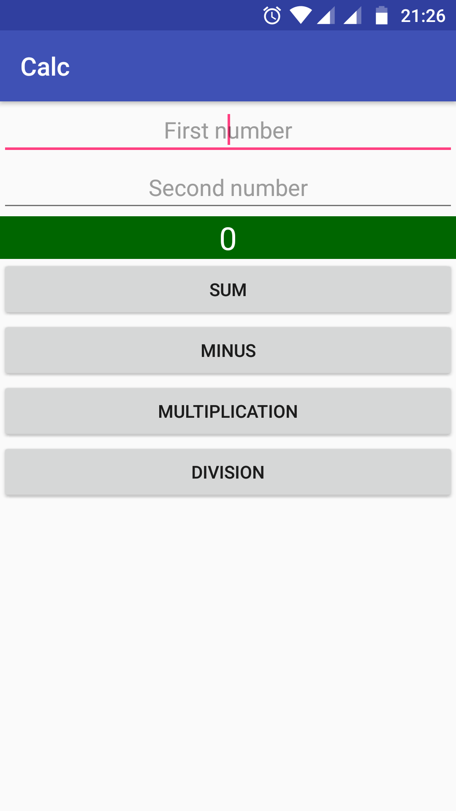
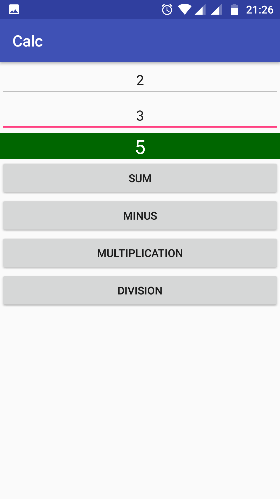
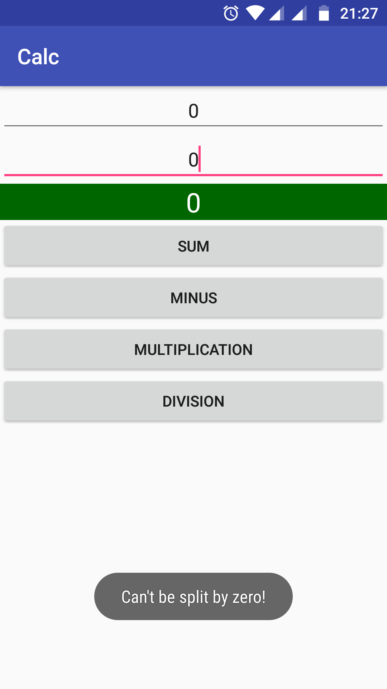

# Android Calc

> Android project using [JUnit](https://junit.org/junit5/) and [Robotium](https://github.com/RobotiumTech/robotium) framework.

## Screenshots

|  |  |  |
| :---: | :---: | :---: |
| Home | Sum calc | Division calc |

## License

[MIT License](http://brenopolanski.mit-license.org/) © Breno Polanski
